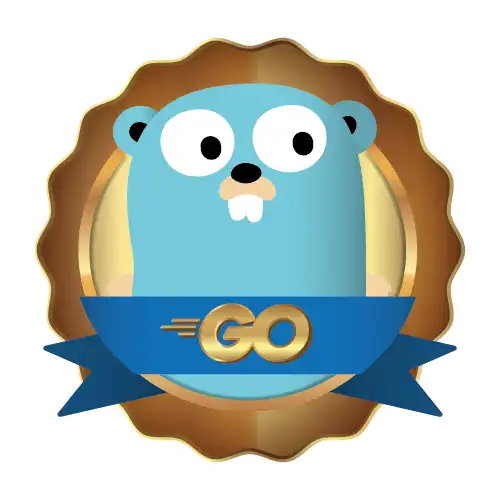
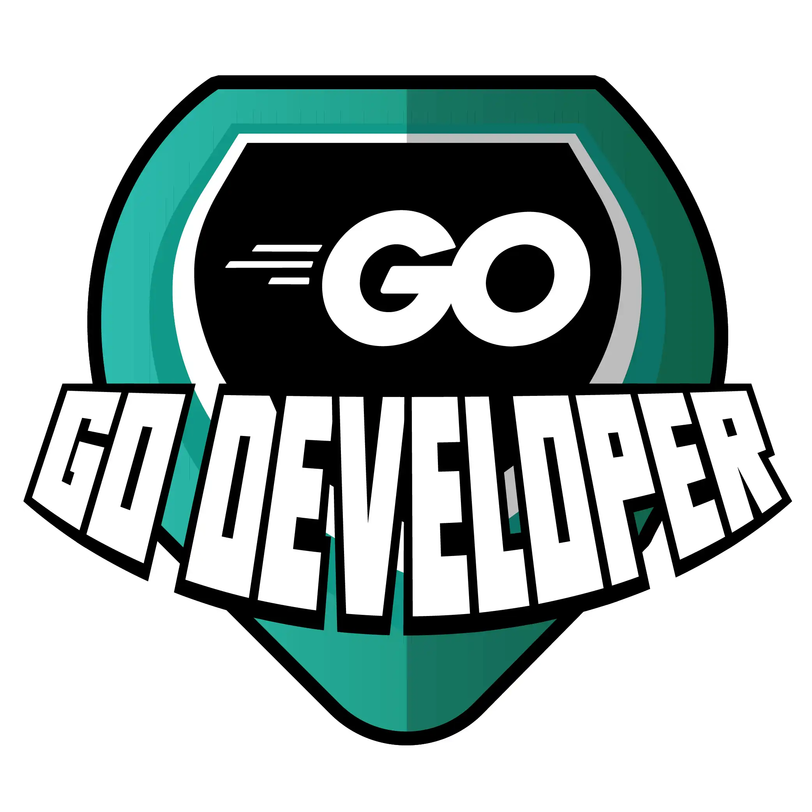

# Formação Go Developer da dio.me
<table align='center'>
    <tr>
        <td></td>
        <td></td>
        <td></td>
    </tr>
</table>

- (ok) Primeiros Passos (5/5)
- (ok) Aprendendo Estruturas em Go (5/5)
- (ok) Ampliando os Seus Conhecimentos em GO (5/5)
- (ok) Servidores e APIs REST em Go (5/5)
- (ok) Aprendendo Testes Unitários em Go (4/4)

  

      
      
      
      
  
 

